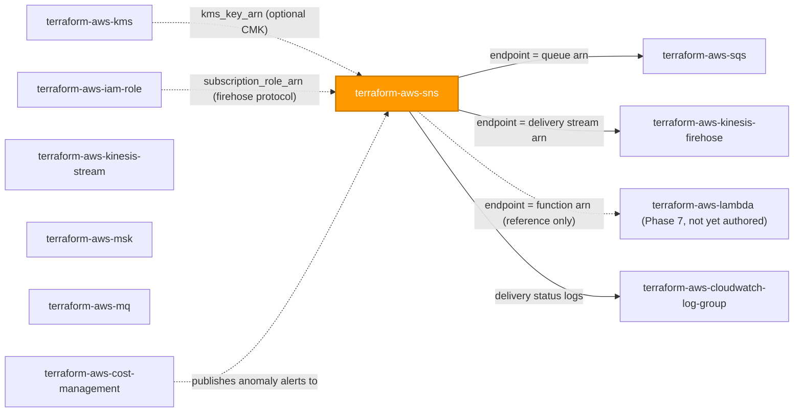
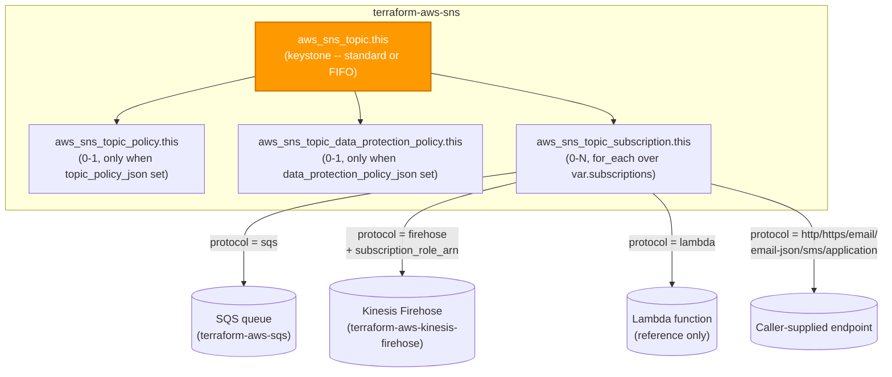

# 🟧 AWS **SNS** Terraform Module

> **Secure-by-default Amazon SNS topic** — SSE-KMS encryption, owner-locked-down access policy, `for_each`-driven subscription fan-out to SQS/Lambda/Firehose/HTTP(S)/email/SMS/mobile, FIFO ordering, and an optional PII data-protection policy, all from a single composite call. Built for the AWS provider **v6.x**.


---

## 🧩 Overview

- 📨 Provisions an **`aws_sns_topic`** keystone — standard or FIFO — plus its directly-attached sub-resources in one call.
- 🔒 **SSE-KMS encryption ON by default** — `kms_master_key_id` defaults to the AWS-managed `alias/aws/sns` key; wire a customer-managed CMK from `terraform-aws-kms` with one variable.
- 🛡️ **Owner-account-only access policy by default** — no `aws_sns_topic_policy` resource is created unless you supply a custom policy document, so SNS's own default (no cross-account/public access) stays in force.
- 🧵 **FIFO support** — strict ordering, content-based deduplication, and high-throughput `MessageGroup` deduplication scope, with a `validation {}` block enforcing the `.fifo` name suffix.
- 🪝 **`for_each`-driven subscriptions** — a `map(object(...))` keyed by a caller-chosen stable name covers `sqs`, `lambda`, `firehose`, `application`, `sms`, `http`, `https`, `email`, and `email-json`, including filter policies, redrive policies, and raw message delivery.
- 🕵️ **Optional data protection policy** — PII/sensitive-data detection, masking, or denial on message bodies, off by default (separately billed, opt-in only).
- 📊 **Delivery status logging** — off by default; opt in per protocol (`application`/`http`/`lambda`/`sqs`/`firehose`) to a CloudWatch Logs IAM role without touching the other protocols.
- 🏷️ **Universal tagging** on the topic (the only taggable resource in this composite); `tags_all` surfaced as an output.

> 💡 **Why it matters:** SNS fans out a single event to every downstream consumer in the event-driven stack — SQS queues, Lambda functions, Firehose archives, and human notification channels. A secure, owner-locked-down topic delivered from one module call keeps the pub/sub fabric from becoming the path of least resistance for a data leak or an unauthorized publisher.

---

## ❤️ Support this project

If these Terraform modules have been helpful to you or your organization, I'd appreciate your support in any of the following ways:

- ⭐ **Star this repository** to help others discover this Terraform module.
- 🤝 **Connect with me on LinkedIn:** [linkedin.com/in/microsoftexpert](https://www.linkedin.com/in/microsoftexpert)
- ☕ **Buy me a coffee:** [buymeacoffee.com/microsoftexpert](https://buymeacoffee.com/microsoftexpert)

Whether it's a star, a professional connection, or a coffee, every gesture helps keep these modules actively maintained and continually improving. Thank you for being part of the community!

---

## 🗺️ Where this fits in the family

`terraform-aws-sns` is a **Phase 2 (app_integration)** module. It originates the topic and is consumed by reference (ARN) by SQS, Kinesis Firehose, Lambda (once authored), and CloudWatch-alarm/Cost-Anomaly-Detection notification targets across the library. Its own optional inputs are by-reference: a CMK from `terraform-aws-kms` and an IAM role from `terraform-aws-iam-role` for Firehose subscriptions.



> ℹ️ `terraform-aws-kinesis-stream`, `terraform-aws-msk`, and `terraform-aws-mq` are Phase 2 siblings shown for family context; none of the three consumes or is consumed by this module directly today.

---

## 🧬 What this module builds



| Resource | Role | Cardinality |
|---|---|---|
| `aws_sns_topic.this` | Keystone topic (standard or FIFO) | 1 |
| `aws_sns_topic_policy.this` | Custom access policy | 0–1 (only when `topic_policy_json` is set) |
| `aws_sns_topic_data_protection_policy.this` | PII detection/masking policy | 0–1 (only when `data_protection_policy_json` is set) |
| `aws_sns_topic_subscription.this` | Subscriber fan-out | per `subscriptions` map entry |

---

## ✅ Provider / Versions

| Requirement | Version |
|---|---|
| Terraform | `>= 1.12.0` |
| `hashicorp/aws` | `>= 6.0, < 7.0` |

No `provider {}` block is declared inside the module — the caller's configured provider (and its region/credentials) is inherited. No `region` variable is exposed; SNS is a regional service with no us-east-1 global-resource coupling.

---

## 🔑 Required IAM Permissions

Least-privilege actions the Terraform identity needs to create, read, update, and delete everything this module manages:

| Action | Required for | Notes |
|---|---|---|
| `sns:CreateTopic`, `sns:DeleteTopic`, `sns:GetTopicAttributes`, `sns:SetTopicAttributes` | Topic lifecycle (name, display name, delivery policy, KMS key id, FIFO settings, tracing) | — |
| `sns:TagResource`, `sns:UntagResource`, `sns:ListTagsForResource` | Tagging the topic | Only `aws_sns_topic` is taggable in this composite |
| `sns:AddPermission`, `sns:RemovePermission` | `aws_sns_topic_policy` (custom access policy) | Only when `topic_policy_json` is supplied |
| `sns:PutDataProtectionPolicy`, `sns:GetDataProtectionPolicy` | `aws_sns_topic_data_protection_policy` | Only when `data_protection_policy_json` is supplied |
| `sns:Subscribe`, `sns:Unsubscribe`, `sns:ListSubscriptionsByTopic`, `sns:GetSubscriptionAttributes`, `sns:SetSubscriptionAttributes` | `aws_sns_topic_subscription` lifecycle | Terraform cannot force-confirm a pending subscription — see AWS Prerequisites |
| `sns:ConfirmSubscription` | Confirming a subscription programmatically | Only relevant for `endpoint_auto_confirms` style flows outside Terraform |
| `kms:DescribeKey` | Validating a caller-supplied CMK id/alias at plan/apply time | Read-only |
| `iam:PassRole` | Passing `subscription_role_arn` to SNS for a `firehose` subscription | **Scope to the specific role ARN**, never `*` |

> ℹ️ **No service-linked role is created or required for SNS.**
>
> ⚠️ **KMS key-policy note:** `kms:Decrypt`, `kms:GenerateDataKey*`, and `kms:Encrypt` for a **customer-managed key** are granted on the **KMS key's own resource policy** (authored by `terraform-aws-kms`), not on this module's caller identity or on the publishing/subscribing principals' IAM policies. This module's Terraform identity only needs `kms:DescribeKey`. Forgetting to update the CMK's key policy to trust `sns.amazonaws.com` and the relevant publish/subscribe principals is the most common cause of a `KMS.AccessDeniedException` at publish time, not a Terraform-apply-time failure.

---

## 📋 AWS Prerequisites

- **No service-linked role** required for SNS.
- **FIFO topics:** `name` must end in `.fifo`; `fifo_topic = true` is required and **immutable** (standard ↔ FIFO is not an in-place update — it forces replacement of the topic and everything attached to it). FIFO topics can only deliver to `sqs` and `firehose` subscription protocols — never `http`/`https`/`email`/`email-json`/`sms`/`application`.
- **Subscription confirmation is a Terraform blind spot.** For `http`, `https`, `email`, and `email-json` protocols (without `endpoint_auto_confirms = true`), AWS requires the endpoint owner to click a confirmation link or visit a `SubscribeURL` **outside of Terraform**. `terraform apply` succeeds and creates the subscription in `PendingConfirmation` state — nothing in Terraform completes that handshake. The `pending_confirmation` output surfaces this so ops runbooks can chase it down. Terraform **cannot** unsubscribe an unconfirmed subscription (`destroy` removes it from state only; the live AWS subscription persists until manually unsubscribed or the parent topic is deleted).
- **Topic policy attachment is eventually consistent.** A `terraform apply` that both creates the topic and attaches a custom policy (`topic_policy_json`) can occasionally need a second apply before `GetTopicAttributes` reflects the new policy consistently.
- **Cross-region subscriptions:** if the SNS topic and its SQS/Lambda/Firehose endpoint live in different Regions, the `aws_sns_topic_subscription` must use a provider configured for the **topic's** Region, not the endpoint's Region.
- **Cross-account subscriptions require Terraform access to both accounts** (or a topic-side policy plus the subscriber's own provider), and both the topic's access policy and the target queue/function's resource policy must independently authorize the relationship.
- **Quotas (soft unless noted):** 100,000 topics per account · 12,500,000 subscriptions per topic · 10 MB max message size (larger payloads need an extended-client pattern via S3, out of scope for this module) · FIFO topics have lower publish-rate ceilings than standard topics unless `fifo_throughput_scope = "MessageGroup"` high-throughput mode is enabled.

---

## 📁 Module Structure

```
terraform-aws-sns/
├── providers.tf # terraform{} + required_providers (aws >= 6.0, < 7.0); no provider block
├── variables.tf # name, FIFO config, topic config, delivery logging, encryption, policies, subscriptions, tags
├── main.tf # locals (policy/DPP gating, effective KMS key) + the four resources
├── outputs.tf # id + arn, name, owner, policy/DPP status, subscription maps, tags_all
├── README.md # this file
└── SCOPE.md # in/out-of-scope, IAM, prerequisites, emits, gotchas
```

---

## ⚙️ Quick Start

```hcl
module "sns" {
  source = "git::https://github.com/microsoftexpert/terraform-aws-sns?ref=v1.0.0"

  name = "billing-events"

  subscriptions = {
    billing-queue = {
      protocol = "sqs"
      endpoint = module.sqs_billing.arn # terraform-aws-sqs
    }
  }

  tags = {
    Environment = "prod"
    CostCenter  = "billing"
  }
}
```

> ⚠️ Pin the source with `?ref=v1.0.0` — never a branch. The queue's own policy must grant the topic `sqs:SendMessage` — see Example Library #6 for the SQS-side policy snippet this module does not create.

---

## 🔌 Cross-Module Contract

### Consumes

Primarily a **standalone-with-references** module — it originates the topic but wires several optional inputs by ARN from sibling modules.

| Input | Type | Source module |
|---|---|---|
| `kms_key_arn` (mapped to `kms_master_key_id`) | `string`, optional, default `null` | `terraform-aws-kms` (or a literal `"alias/aws/sns"` / key id) |
| `subscriptions[*].endpoint` (protocol `sqs`) | `string` (queue ARN) | `terraform-aws-sqs` |
| `subscriptions[*].endpoint` (protocol `lambda`) | `string` (function ARN) | `terraform-aws-lambda` — **not yet authored (Phase 7)**, reference-only today |
| `subscriptions[*].endpoint` + `subscription_role_arn` (protocol `firehose`) | `string` (stream ARN) + `string` (role ARN) | `terraform-aws-kinesis-firehose` + `terraform-aws-iam-role` |
| `subscriptions[*].endpoint` (protocol `http`/`https`/`email`/`email-json`/`sms`/`application`) | `string` (literal) | Caller-supplied, no module dependency |
| `topic_policy_json` | `string`, optional | Caller-authored `data.aws_iam_policy_document` |
| `data_protection_policy_json` | `string`, optional | Caller-authored via `jsonencode` |
| `delivery_status_logging[*].*_role_arn` | `string` (IAM role ARN) | `terraform-aws-iam-role` |

### Emits

| Output | Description | Consumed by |
|---|---|---|
| `id` | Topic ARN (identical to `arn` — see Architecture Notes) | Any module referencing the topic generically |
| `arn` | Topic ARN (`arn:aws:sns:<region>:<account-id>:<name>`) | `terraform-aws-sqs` (queue policy `Condition.ArnEquals`), `terraform-aws-iam-policy` (publish/subscribe grants), CloudWatch alarm actions, Lambda event-source/DLQ targets |
| `name` | Topic name | Tagging, monitoring, naming-convention audits |
| `owner` | AWS account id of the topic owner | Cross-account policy authoring, audit |
| `topic_policy_attached` | Whether a custom access policy was created | Audit / drift checks |
| `data_protection_policy_enabled` | Whether a data protection policy was created | Audit / compliance reporting |
| `subscription_arns` | Map (by subscription key) of subscription ARNs | Audit, `pending_confirmation` follow-up tooling |
| `subscription_pending_confirmation` | Map (by subscription key) of `pending_confirmation` booleans | Ops runbooks chasing down manual confirmations |
| `tags_all` | Computed merge of resource tags over provider `default_tags` | Governance/audit |

---

## 📚 Example Library

<details>
<summary><b>1 · Minimal standard topic</b></summary>

```hcl
module "sns" {
  source = "git::https://github.com/microsoftexpert/terraform-aws-sns?ref=v1.0.0"

  name = "app-events"
}
```
`enable_encryption` defaults to `true`, so this topic is already SSE-KMS encrypted with the AWS-managed `alias/aws/sns` key and has no custom access policy (owner-only default).
</details>

<details>
<summary><b>2 · FIFO topic with content-based deduplication</b></summary>

```hcl
module "sns" {
  source = "git::https://github.com/microsoftexpert/terraform-aws-sns?ref=v1.0.0"

  name                        = "orders.fifo"
  fifo_topic                  = true
  content_based_deduplication = true

  subscriptions = {
    orders-queue = {
      protocol = "sqs"
      endpoint = module.sqs_orders_fifo.arn # must also be a FIFO queue
    }
  }
}
```
</details>

<details>
<summary><b>3 · High-throughput FIFO (MessageGroup dedup scope)</b></summary>

```hcl
module "sns" {
  source = "git::https://github.com/microsoftexpert/terraform-aws-sns?ref=v1.0.0"

  name                  = "trades.fifo"
  fifo_topic            = true
  fifo_throughput_scope = "MessageGroup" # unlocks the higher per-topic publish rate

  subscriptions = {
    trades-queue = {
      protocol = "sqs"
      endpoint = module.sqs_trades_fifo.arn
    }
  }
}
```
</details>

<details>
<summary><b>4 · Tags — merge with provider <code>default_tags</code></b></summary>

```hcl
# Caller's provider block owns default_tags; resource tags win on key conflict.
provider "aws" {
  region = "us-east-1"
  default_tags {
    tags = { Owner = "platform", ManagedBy = "terraform" }
  }
}

module "sns" {
  source = "git::https://github.com/microsoftexpert/terraform-aws-sns?ref=v1.0.0"

  name = "tagged-topic"

  tags = {
    Environment = "prod"
    Owner       = "messaging-team" # overrides default_tags Owner on the topic
  }
}
# module.sns.tags_all => { Owner="messaging-team", ManagedBy="terraform", Environment="prod" }
```
</details>

<details>
<summary><b>5 · Customer-managed KMS key (wired from terraform-aws-kms)</b></summary>

```hcl
module "kms" {
  source = "git::https://github.com/microsoftexpert/terraform-aws-kms?ref=v1.0.0"
  name   = "sns-cmk"

  key_service_principals = ["sns.amazonaws.com"] # key policy must trust SNS
}

module "sns" {
  source = "git::https://github.com/microsoftexpert/terraform-aws-sns?ref=v1.0.0"

  name        = "encrypted-events"
  kms_key_arn = module.kms.arn
}
```
> ⚠️ The CMK's key policy must grant `kms:Decrypt` / `kms:GenerateDataKey*` to `sns.amazonaws.com` and to every publishing/subscribing principal — this module only validates the key reference with `kms:DescribeKey`.
</details>

<details>
<summary><b>6 · SQS subscription — queue policy snippet the caller must own</b></summary>

```hcl
module "sns" {
  source = "git::https://github.com/microsoftexpert/terraform-aws-sns?ref=v1.0.0"

  name = "fulfillment-events"

  subscriptions = {
    fulfillment-queue = {
      protocol             = "sqs"
      endpoint             = module.sqs_fulfillment.arn
      raw_message_delivery = true
    }
  }
}

# This module does NOT create the queue's policy. Grant sns.amazonaws.com
# sqs:SendMessage on the queue policy, scoped to this topic's arn, alongside
# terraform-aws-sqs:
data "aws_iam_policy_document" "fulfillment_queue_policy" {
  statement {
    sid     = "AllowSNSPublish"
    effect  = "Allow"
    actions = ["sqs:SendMessage"]

    principals {
      type        = "Service"
      identifiers = ["sns.amazonaws.com"]
    }

    resources = [module.sqs_fulfillment.arn]

    condition {
      test     = "ArnEquals"
      variable = "aws:SourceArn"
      values   = [module.sns.arn]
    }
  }
}
```
</details>

<details>
<summary><b>7 · HTTPS subscription with manual-confirmation callout</b></summary>

```hcl
module "sns" {
  source = "git::https://github.com/microsoftexpert/terraform-aws-sns?ref=v1.0.0"

  name = "webhook-events"

  subscriptions = {
    partner-webhook = {
      protocol                        = "https"
      endpoint                        = "https://partner.example.com/sns-webhook"
      confirmation_timeout_in_minutes = 5
    }
  }
}

# module.sns.subscription_pending_confirmation["partner-webhook"] will be TRUE
# immediately after apply — the partner endpoint must independently retrieve
# the SubscribeURL from the SNS SubscriptionConfirmation POST and visit it.
# Terraform cannot complete this handshake; poll the output or the console
# until it flips to false, or set endpoint_auto_confirms = true if the
# receiving system supports it (e.g. PagerDuty-style auto-confirm).
```
</details>

<details>
<summary><b>8 · Email subscription with manual-confirmation callout</b></summary>

```hcl
module "sns" {
  source = "git::https://github.com/microsoftexpert/terraform-aws-sns?ref=v1.0.0"

  name = "ops-alerts"

  subscriptions = {
    ops-team = {
      protocol = "email"
      endpoint = "ops-team@financialpartners.com"
    }
  }
}

# The recipient must click "Confirm subscription" in the email SNS sends.
# module.sns.subscription_pending_confirmation["ops-team"] stays true until
# that click happens -- there is no Terraform-side automation for this.
```
</details>

<details>
<summary><b>9 · Firehose subscription (subscription_role_arn requirement)</b></summary>

```hcl
module "firehose_subscribe_role" {
  source = "git::https://github.com/microsoftexpert/terraform-aws-iam-role?ref=v1.0.0"
  name   = "sns-to-firehose"
  # trust policy: sns.amazonaws.com; permissions: firehose:PutRecord* on the target stream
}

module "sns" {
  source = "git::https://github.com/microsoftexpert/terraform-aws-sns?ref=v1.0.0"

  name = "audit-events"

  subscriptions = {
    firehose-archive = {
      protocol              = "firehose"
      endpoint              = module.firehose_archive.arn # terraform-aws-kinesis-firehose
      subscription_role_arn = module.firehose_subscribe_role.arn
    }
  }
}
```
> ⚠️ Omitting `subscription_role_arn` when `protocol = "firehose"` fails a `variable` `validation {}` block in this module at `terraform plan` time — it never reaches an apply-time API error.
</details>

<details>
<summary><b>10 · Lambda subscription (reference-only — terraform-aws-lambda not yet authored)</b></summary>

```hcl
module "sns" {
  source = "git::https://github.com/microsoftexpert/terraform-aws-sns?ref=v1.0.0"

  name = "order-created"

  subscriptions = {
    process-order = {
      protocol = "lambda"
      endpoint = "arn:aws:lambda:us-east-1:123456789012:function:process-order" # literal ARN today
    }
  }
}

# terraform-aws-lambda is a Phase 7 module and does not exist yet. Until it ships,
# wire the function ARN as a literal string or a remote-state / data-source
# lookup. The receiving Lambda's own resource-based policy must separately
# grant sns.amazonaws.com lambda:InvokeFunction, scoped to this topic's arn --
# this module does not create that grant.
```
</details>

<details>
<summary><b>11 · Data protection policy example (PII deny statement)</b></summary>

```hcl
module "sns" {
  source = "git::https://github.com/microsoftexpert/terraform-aws-sns?ref=v1.0.0"

  name = "customer-notifications"

  data_protection_policy_json = jsonencode({
    Name        = "deny-email-address-in-body"
    Description = "Block publish of raw email addresses in message bodies"
    Version     = "2021-06-01"
    Statement = [
      {
        Sid            = "DenyEmailAddress"
        DataDirection  = "Inbound"
        DataIdentifier = ["arn:aws:dataprotection::aws:data-identifier/EmailAddress"]
        Operation      = { Deny = {} }
        Principal      = ["*"]
      }
    ]
  })
}
```
> ℹ️ This is a distinct, separately-billed inline-inspection feature — off by default. Enabling it adds processing overhead to every publish call.
</details>

<details>
<summary><b>12 · Custom topic access policy (cross-account publish grant)</b></summary>

```hcl
data "aws_iam_policy_document" "cross_account_publish" {
  statement {
    sid     = "AllowAccountRootManage"
    effect  = "Allow"
    actions = ["SNS:GetTopicAttributes", "SNS:SetTopicAttributes", "SNS:AddPermission", "SNS:RemovePermission", "SNS:DeleteTopic", "SNS:Subscribe", "SNS:ListSubscriptionsByTopic", "SNS:Publish", "SNS:Receive"]

    principals {
      type        = "AWS"
      identifiers = ["arn:aws:iam::111122223333:root"]
    }

    resources = ["arn:aws:sns:us-east-1:111122223333:partner-integration"]

    condition {
      test     = "StringEquals"
      variable = "AWS:SourceOwner"
      values   = ["111122223333"]
    }
  }

  statement {
    sid     = "AllowPartnerAccountPublish"
    effect  = "Allow"
    actions = ["SNS:Publish"]

    principals {
      type        = "AWS"
      identifiers = ["arn:aws:iam::444455556666:root"] # partner account
    }

    resources = ["arn:aws:sns:us-east-1:111122223333:partner-integration"]
  }
}

module "sns" {
  source = "git::https://github.com/microsoftexpert/terraform-aws-sns?ref=v1.0.0"

  name              = "partner-integration"
  topic_policy_json = data.aws_iam_policy_document.cross_account_publish.json
}
```
</details>

<details>
<summary><b>13 · Secure-by-default opt-out — unencrypted topic (documented exception)</b></summary>

```hcl
module "sns" {
  source = "git::https://github.com/microsoftexpert/terraform-aws-sns?ref=v1.0.0"

  name              = "public-status-page"
  enable_encryption = false # opt-out of the SSE-KMS baseline

  # ⚠️ EXCEPTION REQUIRED: This topic carries only public, non-sensitive status
  # messages (e.g. a public status-page feed) with no PII/privacy-regulation-relevant content.
  # Document the business justification and get sign-off from Security/Compliance
  # before disabling encryption on any topic that could ever carry member data.
}
```
</details>

<details>
<summary><b>14 · <code>for_each</code> pattern — multiple subscriptions in one call</b></summary>

```hcl
module "sns" {
  source = "git::https://github.com/microsoftexpert/terraform-aws-sns?ref=v1.0.0"

  name = "loan-decisioning-events"

  subscriptions = {
    decisioning-queue = {
      protocol = "sqs"
      endpoint = module.sqs_decisioning.arn
    }
    audit-firehose = {
      protocol              = "firehose"
      endpoint              = module.firehose_audit.arn
      subscription_role_arn = module.firehose_subscribe_role.arn
    }
    risk-team-email = {
      protocol = "email"
      endpoint = "risk-team@financialpartners.com"
      filter_policy = jsonencode({
        decision = ["denied", "manual_review"]
      })
    }
  }

  tags = { Environment = "prod", App = "loan-decisioning" }
}
```
</details>

<details>
<summary><b>15 · Import block example</b></summary>

```hcl
import {
  to = module.sns.aws_sns_topic.this
  id = "arn:aws:sns:us-east-1:123456789012:legacy-notifications"
}

module "sns" {
  source = "git::https://github.com/microsoftexpert/terraform-aws-sns?ref=v1.0.0"

  name = "legacy-notifications"
  #... match the imported topic's existing configuration before applying
}
```
</details>

<details>
<summary><b>16 · End-to-end composition — SNS + SQS + KMS + IAM role (finale)</b></summary>

```hcl
module "kms" {
  source = "git::https://github.com/microsoftexpert/terraform-aws-kms?ref=v1.0.0"
  name   = "events-cmk"

  key_service_principals = ["sns.amazonaws.com", "sqs.amazonaws.com"]
}

module "sqs_billing" {
  source      = "git::https://github.com/microsoftexpert/terraform-aws-sqs?ref=v1.0.0"
  name        = "billing-events"
  kms_key_arn = module.kms.arn
}

module "firehose_subscribe_role" {
  source = "git::https://github.com/microsoftexpert/terraform-aws-iam-role?ref=v1.0.0"
  name   = "sns-to-firehose-billing"
  # trust policy: sns.amazonaws.com
}

module "sns" {
  source = "git::https://github.com/microsoftexpert/terraform-aws-sns?ref=v1.0.0"

  name        = "billing-events"
  kms_key_arn = module.kms.arn

  subscriptions = {
    billing-queue = {
      protocol             = "sqs"
      endpoint             = module.sqs_billing.arn
      raw_message_delivery = true
    }
    audit-firehose = {
      protocol              = "firehose"
      endpoint              = module.firehose_audit.arn
      subscription_role_arn = module.firehose_subscribe_role.arn
    }
  }

  tags = { Environment = "prod", App = "billing" }
}

# Queue-side policy granting the topic sqs:SendMessage (owned alongside the queue,
# not by this module -- see Example 6 for the full statement).
data "aws_iam_policy_document" "billing_queue_policy" {
  statement {
    sid     = "AllowSNSPublish"
    effect  = "Allow"
    actions = ["sqs:SendMessage"]
    principals {
      type        = "Service"
      identifiers = ["sns.amazonaws.com"]
    }
    resources = [module.sqs_billing.arn]
    condition {
      test     = "ArnEquals"
      variable = "aws:SourceArn"
      values   = [module.sns.arn]
    }
  }
}
```
</details>

---

## 📥 Inputs

> ℹ️ High-level grouping:

- **Core:** `name`
- **FIFO:** `fifo_topic`, `content_based_deduplication`, `fifo_throughput_scope`, `archive_policy_json`
- **Topic configuration:** `display_name`, `delivery_policy_json`, `signature_version`, `tracing_config`
- **Delivery status logging:** `delivery_status_logging` — `map(object({ success_feedback_role_arn?, success_feedback_sample_rate?, failure_feedback_role_arn? }))` keyed by protocol
- **Encryption:** `enable_encryption`, `kms_key_arn`
- **Access policy:** `topic_policy_json`
- **Data protection:** `data_protection_policy_json`
- **Subscriptions:** `subscriptions` — `map(object({ protocol, endpoint, subscription_role_arn?, raw_message_delivery?, filter_policy?, filter_policy_scope?, redrive_policy?, replay_policy?, delivery_policy?, confirmation_timeout_in_minutes?, endpoint_auto_confirms? }))`
- **Universal:** `tags`

---

## 🧾 Outputs

- **Primary:** `id`, `arn` (identical values — see Architecture Notes)
- **Topic attributes:** `name`, `owner`, `beginning_archive_time`
- **Policy status:** `topic_policy_attached`, `data_protection_policy_enabled`
- **Subscriptions (maps keyed by the caller's `subscriptions` key):** `subscription_arns`, `subscription_pending_confirmation`, `subscription_confirmation_was_authenticated`, `subscription_owner_ids`
- **Tags:** `tags_all`

> ℹ️ No outputs are marked `sensitive` — this module emits no secrets. `subscription_pending_confirmation` is the one output ops runbooks should actively poll (see AWS Prerequisites).

---

## 🧠 Architecture Notes

- **ARN / ID formats:** `arn:aws:sns:<region>:<account-id>:<name>`. **`id` and `arn` are the identical value** — unlike most AWS resources, SNS topics have no separate short resource id. Both are still emitted as distinct outputs to keep this module's contract consistent with every other `terraform-aws-*` module. Subscription ARNs append `:<subscription-uuid>` to the topic ARN.
- **Force-new / immutable fields:** `name` is effectively immutable — SNS has no rename operation, so changing it destroys and recreates `aws_sns_topic.this` and, transitively, every subscription and policy attached to it. `fifo_topic` is immutable (standard ↔ FIFO requires replacement). `content_based_deduplication` is **not** force-new and can be flipped in place on an existing FIFO topic.
- **`tags` ↔ `tags_all` ↔ `default_tags`:** `var.tags` flows to `aws_sns_topic.this.tags` only — `aws_sns_topic_policy`, `aws_sns_topic_subscription`, and `aws_sns_topic_data_protection_policy` accept **no `tags` argument at all** in the AWS provider schema. `tags_all` is the provider-computed union of the topic's resource tags over the caller's provider `default_tags`; resource tags win on key conflict. `default_tags` is the caller's provider-block concern and is never set inside the module.
- **Eventual consistency:** a topic-policy attachment can lag one `GetTopicAttributes` read cycle behind an `AddPermission` call in the same apply; a second `apply` (or `refresh`) resolves it. Subscription confirmation for partially-supported protocols (`http`/`https`/`email`/`email-json`) happens entirely outside Terraform's control loop.
- **Destroy ordering:** deleting the topic cascades server-side and removes every attached subscription in AWS, but Terraform still tracks each subscription as a separate state entry — expect (benign) no-op `DeleteSubscription` calls in the destroy plan against subscriptions AWS already removed when the topic itself is destroyed in the same pass.
- **Topic policy is a separate resource, not an attribute.** `aws_sns_topic_policy` attaches independently of `aws_sns_topic`; destroying just the policy resource reverts the topic to SNS's built-in owner-only default policy — it does not delete the topic.
- **No `us-east-1` constraint.** SNS is a regional service; the module inherits the caller's provider Region and declares no `region` variable.

---

## 🧱 Design Principles

Secure-by-default posture and the explicit opt-out for each:

| Hardened default | Behavior | Opt-out / control |
|---|---|---|
| **Encryption at rest (SSE-KMS)** | `enable_encryption = true`; `kms_master_key_id` defaults to the AWS-managed `alias/aws/sns` key | `enable_encryption = false` (documented exception required — see Example 13) |
| **Topic access policy** | Owner-account-only publish/subscribe/manage (no public or cross-account principals) unless a custom policy is supplied | Supply `topic_policy_json` with broader principals — caller's responsibility to scope tightly |
| **Data protection policy (PII detection/masking)** | Off by default — no additional inline-inspection overhead unless opted in | Supply `data_protection_policy_json` to enable `Deny`/`Deidentify`/`Audit` statements |
| **Delivery status logging** | Off by default — no CloudWatch Logs IAM role required for any protocol | Supply the relevant entry in `delivery_status_logging` to enable per-protocol logging |
| **FIFO ordering / dedup** | Standard topic by default (`fifo_topic = false`) | Set `fifo_topic = true` (name must end `.fifo`); `content_based_deduplication` and `fifo_throughput_scope` are independent opt-ins |

Other principles: subscriptions modeled as `map(object(...))` keyed by a caller-chosen stable name (never a list) so adding/removing one subscription never perturbs the others under `for_each`; the topic access policy stays an opaque JSON string (mirroring how AWS itself treats SNS policies) rather than a structured object, keeping the variable surface simple while preserving full policy control; Lambda and Firehose subscription targets are accepted as plain ARN strings today so this module needs no change once `terraform-aws-lambda` (Phase 7) ships.

---

## 🚀 Runbook

```bash
terraform init -backend=false
terraform validate
terraform fmt -check
terraform plan # requires valid AWS credentials (profile / SSO / OIDC) + a region
terraform apply
terraform output
```

> ⚠️ `plan` / `apply` require valid AWS credentials and a configured region (provider block / `AWS_PROFILE` / SSO / OIDC). Always pin the module source with `?ref=v1.0.0`, never a branch.

---

## 🧪 Testing

- `terraform init -backend=false && terraform validate` — schema + reference integrity.
- `terraform fmt -check` — formatting.
- `terraform plan` against a sandbox account — confirm the topic, any conditional policy/data-protection resources, and every subscription entry appear with the expected attributes.
- After `apply`, poll `subscription_pending_confirmation` for `http`/`https`/`email`/`email-json` subscriptions until they flip to `false` (manual confirmation completed).
- Publish a test message and confirm delivery at each subscribed endpoint (SQS queue depth, Lambda invocation count, Firehose delivery stream records).
- Destroy test in a throwaway account to confirm the benign no-op `DeleteSubscription` behavior described in Architecture Notes.

---

## 💬 Example Output

```text
Apply complete! Resources: 3 added, 0 changed, 0 destroyed.

Outputs:

arn = "arn:aws:sns:us-east-1:123456789012:billing-events"
id = "arn:aws:sns:us-east-1:123456789012:billing-events"
name = "billing-events"
owner = "123456789012"
topic_policy_attached = false
data_protection_policy_enabled = false
subscription_arns = { "billing-queue" = "arn:aws:sns:us-east-1:123456789012:billing-events:8a21d249-4329-4871-acc6-7be709c6ea7f" }
subscription_pending_confirmation = { "billing-queue" = false }
tags_all = { "Environment" = "prod", "CostCenter" = "billing" }
```

---

## 🔍 Troubleshooting

- **Tag drift / unexpected tags:** Caused by `default_tags` overlap. `tags_all` merges the topic's resource tags over provider `default_tags` with resource tags winning — if a value differs from what you set, a `default_tags` entry is colliding. Only `aws_sns_topic` carries tags in this composite.
- **Credential-chain failures (`NoCredentialProviders` / `ExpiredToken`):** No valid credentials resolved. Set `AWS_PROFILE`, refresh SSO, or confirm the OIDC role assumption in CI. The module never takes credentials as variables.
- **`KMS.AccessDeniedException` at publish/subscribe time (not at `apply`):** The CMK's key policy does not trust `sns.amazonaws.com` or the calling principal. This module only validates the key reference (`kms:DescribeKey`) — grant `kms:Decrypt`/`kms:GenerateDataKey*` on the **key policy** itself (`terraform-aws-kms`).
- **Subscription stuck `PendingConfirmation` forever:** Expected for `http`/`https`/`email`/`email-json` without `endpoint_auto_confirms = true` — Terraform cannot complete this handshake. Confirm manually (click the email link / visit the `SubscribeURL`) or set `endpoint_auto_confirms = true` only for endpoints that genuinely auto-confirm.
- **`firehose` subscription fails at `plan` with a validation error:** `subscription_role_arn` is required whenever `protocol = "firehose"` — this module enforces it in a `variable` `validation {}` block so the failure surfaces before `apply`, not as an opaque AWS API error.
- **`region / us-east-1` errors:** Not applicable — SNS has no global-resource coupling; if you see a region mismatch error it is almost always a cross-region subscription using the wrong provider (see AWS Prerequisites).
- **IAM `AccessDenied` on create/update:** An action from the Required IAM Permissions table is missing — commonly `sns:AddPermission` (custom `topic_policy_json`) or `iam:PassRole` (Firehose `subscription_role_arn`).
- **Destroy shows subscription `DeleteSubscription` no-ops:** Expected — deleting the topic cascades subscription deletion server-side before Terraform gets to them individually. Benign.
- **Standard-to-FIFO conversion attempt fails / forces replacement:** Expected — `fifo_topic` is immutable. Plan FIFO vs. standard at design time; migrating later requires a new topic and a subscriber cutover, not an in-place update.

---

## 🔗 Related Docs

- Terraform Registry — `hashicorp/aws` provider: `aws_sns_topic`, `aws_sns_topic_policy`, `aws_sns_topic_subscription`, `aws_sns_topic_data_protection_policy`
- AWS — *Amazon SNS server-side encryption* and *AWS managed SNS key* (Developer Guide)
- AWS — *Amazon SNS FIFO topics* and *Enabling high throughput for FIFO topics* (Developer Guide)
- AWS — *Confirm your subscription* / *HTTP(S) endpoint subscription confirmation* (Developer Guide)
- AWS — *Amazon SNS identity-based policies* (Developer Guide)
- — `terraform-aws-kms`, `terraform-aws-iam-role`, `terraform-aws-sqs`, `terraform-aws-kinesis-firehose` (sibling modules)

---

> 🧡 *"Infrastructure as Code should be standardized, consistent, and secure."*
